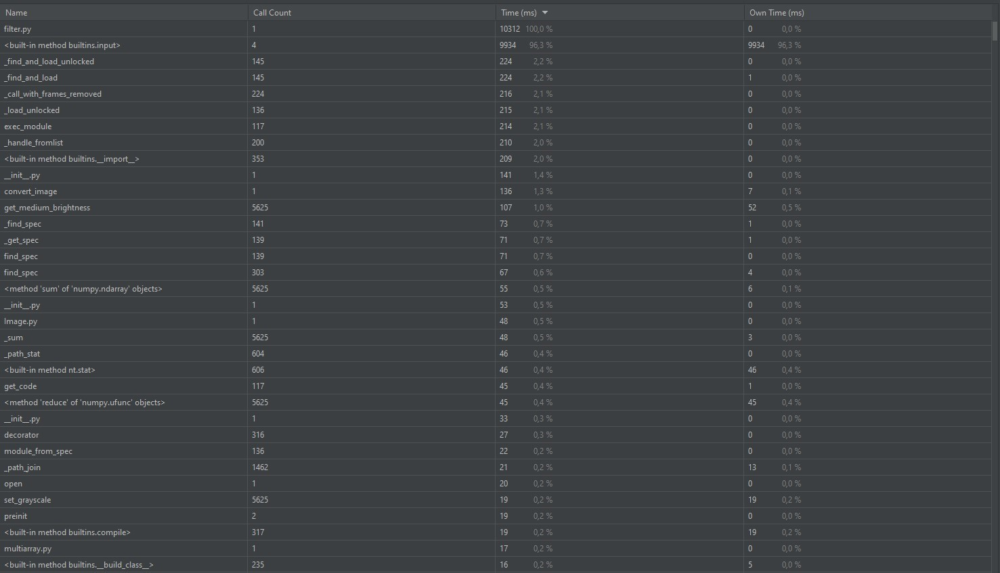
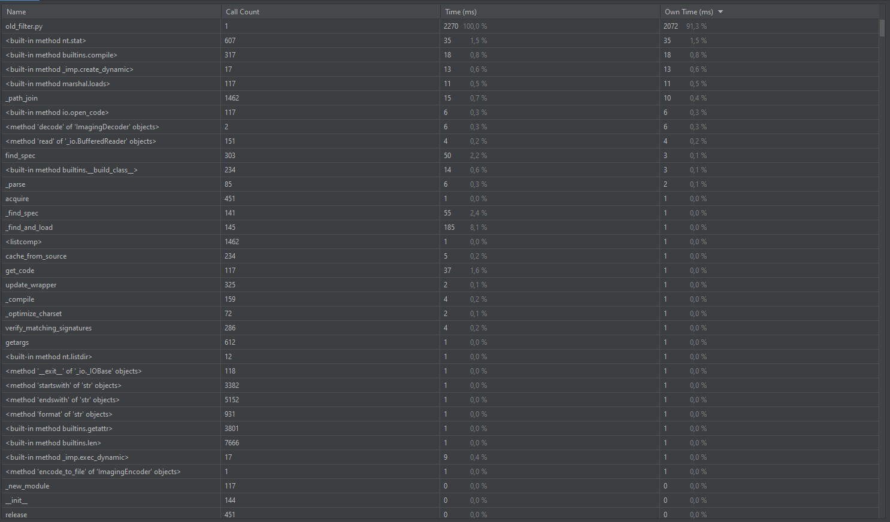
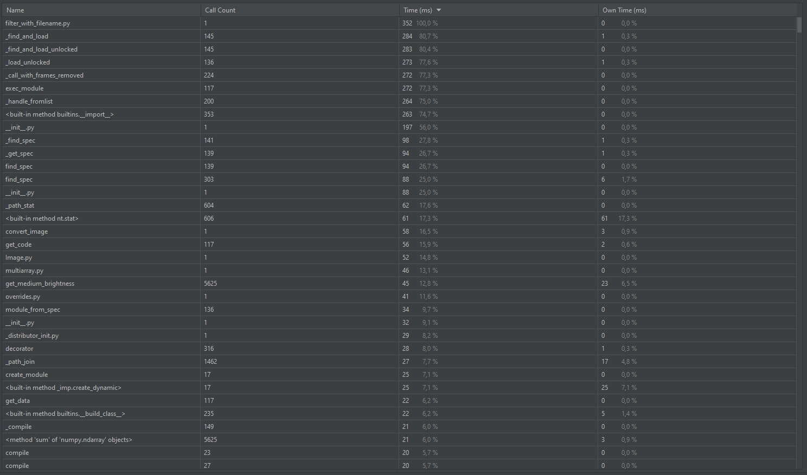
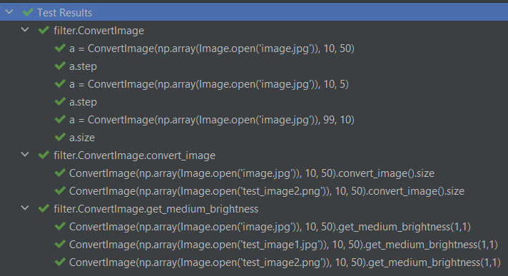
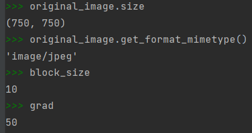

# Pixel-art
## Размер блока - 10. Количество градаций - 50.
### Исходное изображение:

## filter.py

### Полученная картинка:

## old_filter.py

### Полученная картинка:

## filter_with_filename.py

#### В файле filter.py большая часть времени выполнения затрачивается на ввод данных пользователем (9934 ms), это можно увидеть на соответствующем скриншоте. Файл old_filter.py не взаимодействует с пользователем, поэтому время его выполнения значительно меньше (2270 ms). Создав filter_with_filename.py - копию файла filter.py без пользовательского ввода, можно увидеть значительное уменьшение время выполнения (352 ms). Следовательно отрефакторенный код в файле filter_with_filename.py работает быстрее, чем код в old_filter.py.

## Тестирование: 

## Отладчик:

